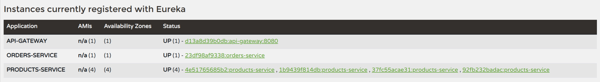
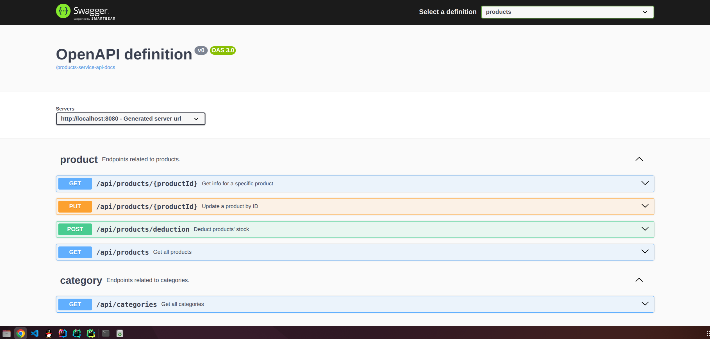
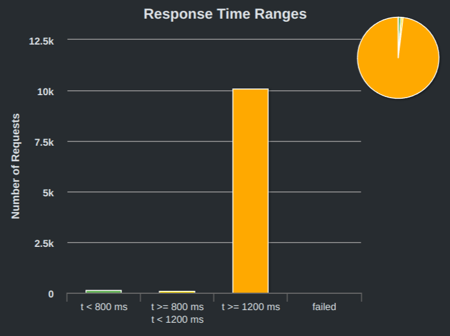
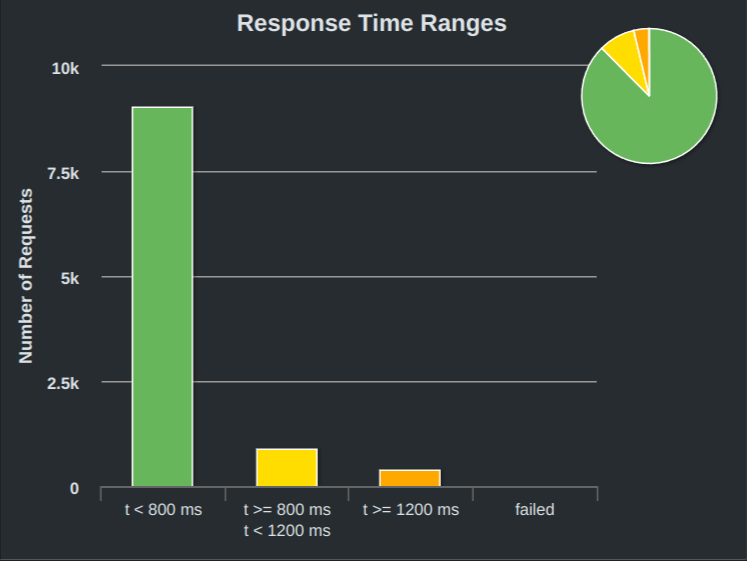
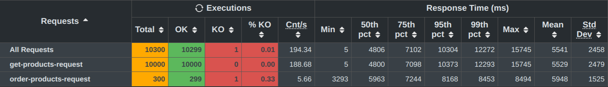
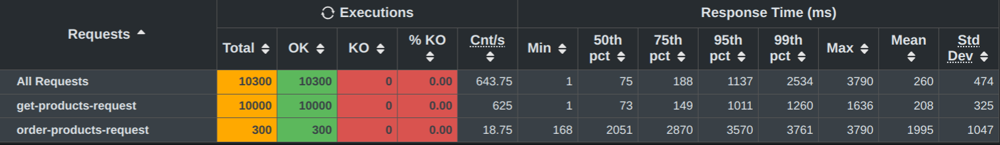

# 作业六：微服务架构
## 项目结构
```
.
├── database                    # 数据库初始化脚本
├── webpos-api                  # OpenAPI接口定义
├── webpos-api-gateway          # API网关
├── webpos-config-server        # 配置服务器
├── webpos-discovery-server     # Eureka注册中心
├── webpos-orders-service       # 订单服务
└── webpos-products-service     # 商品服务
```

本项目使用[docker compose](https://docs.docker.com/compose/)进行容器管理，使用的容器包括
- [Spring Cloud Config Server](https://spring.io/projects/spring-cloud-config): 用于向各个服务器分发配置。
- [Spring Cloud Netflix Eureka Server](https://spring.io/projects/spring-cloud-netflix): 用于注册与发现微服务，对外暴露8761端口。
- [Spring Cloud Gateway](https://spring.io/projects/spring-cloud-gateway)：用于提供API网关，在8080端口上提供服务。
- [Apache Seata](https://www.seata.io/zh-cn/)：用于分布式事务管理。
- [MySQL](https://www.mysql.com/)：用于数据库存储。
- [Redis](https://redis.io/)：用于实现数据缓存。
- Products-Service：商品微服务。
- Orders-Service：订单微服务。

使用以下命令进行容器构建：
```shell
docker compose build
```

启动所有容器：
```shell
docker compose up
```

## 系统介绍

1. 系统启动时，Eureka Server, GateWay, Products-Service, Orders-Service从Config Server中拉取配置。
2. 启动完成后，GateWay, Products-Service, Orders-Service会向Eureka Server注册，此时可通过访问[http://localhost:8761](http://localhost:8761)查看微服务注册情况，如下图所示：

3. Gateway使用Spring Doc配置了OpenAPI文档，会自动收集各个微服务的接口文档并集中展示，可通过访问[http://localhost:8080](http://localhost:8080)查看Gateway对外提供的接口，如下图所示：

4. 通过`POST /api/orders`接口提交订单时，订单微服务会通过`@GlobalTransaction`注解发起分布式事务请求，通知Seata的Transaction Coordinator开启新的全局事务。然后通过`RestTemplate`调用商品微服务，请求减少商品库存，请求成功后再向订单数据库中插入新的记录，最后再触发全局事务提交。如果因为库存不足、商品已下架、商品服务繁忙等原因导致请求失败，则会触发全局事务回滚，保证数据的一致性。

## 微服务水平拓展
测试环境
- CPU：AMD Ryzen 7 5800H（8核16线程）
- Memory：8GBx2 DDR4 3200MHz
- OS：Ubuntu 22.04.4 LTS

测试负载

测试负载与作业5大致相同，不过由于分布式事务管理以及微服务调用带来的额外开销，为避免请求超时，本次实验的测试负载略有降低：首先每秒向服务器发送100个GET请求，持续5s，对服务器进行预热。然后2000个用户每间隔1s向服务器查询随机的商品信息，重复5次。最后300个用户同时提交随机订单。该场景模拟了一个典型的整点商品秒杀活动。

测试配置为：
- 使用**1**个商品微服务，限制每个微服务的可用CPU数量为`cpus=1`。
- 使用**4**个商品微服务，限制每个微服务的可用CPU数量为`cpus=1`。加入`@LoadBalanced`注解实现Client-side负载均衡，在API Gateway上配置使用负载均衡，使用Redis缓存商品信息，从而实现对单个微服务的水平拓展。

测试结果依次如下图所示：

<div class="half" style="text-align: center;">
    
    
</div>

详细数据依次如下表所示：



在仅使用1个商品微服务时，系统对商品信息获取请求的平均响应时间为`5529ms`，对订单提交请求的平均响应时间为`5948ms`。在水平拓展商品微服务至4个服务器，且引入Redis缓存后，系统对商品信息获取请求的平均响应时间降低至`208ms`，对订单提交请求的平均响应时间降低至`1995ms`，可见系统的响应速率得到了较大提升。

通过水平拓展商品微服务数量，并使用负载均衡将请求分发至各个服务器，同时引入数据缓存降低查询时间，系统的响应速率得到了较大提升。可见在微服务架构下，无需对整个系统的所有服务进行水平拓展，只需对计算负载较大的微服务进行水平拓展即可有效提升系统性能。

## RestTemplate服务间访问与Client-side负载均衡
订单服务需要请求商品服务减少商品库存，该过程使用RestTemplate实现，且通过加入`@LoadBalanced`注解实现了Client-side负载均衡，上一节的实验即验证了负载均衡对系统性能提升的作用。Seata分布式事务处理框架会拦截RestTemplate发送与接受的消息，并在其中自动加入与解析全局事务ID，从而以非侵入式的方式实现了分布式事务管理。服务间访问的主要流程为：
```java
@GlobalTransactional
@Transactional
public void addOrders(List<Order> orders) {
    HttpEntity<String> request; // 构造访问请求
    ...
    // 使用RestTemplate进行服务间访问，访问失败则触发全局事务回滚
    ResponseEntity<String> response = restTemplate.postForEntity(
            "http://products-service/api/products/deduction", request, String.class);
    if (response.getStatusCode().is2xxSuccessful()) {
        orderRepository.saveAll(orders);
    }
}
```

## 断路器机制
商品微服务中使用了断路器机制，如果在查询商品信息时，因为数据库繁忙、锁等待时间过长等原因导致查询时间超过阈值，则断路器会返回默认的商品数据，避免上层服务失效。

在商品服务中配置断路器：
```java
TimeLimiterConfig timeLimiterConfig = TimeLimiterConfig.custom()
    .timeoutDuration(Duration.ofSeconds(5))
    .build();
        
CircuitBreakerConfig circuitBreakerConfig = CircuitBreakerConfig.custom()
    .failureRateThreshold(50)
    .waitDurationInOpenState(Duration.ofMillis(1000))
    .slidingWindowSize(2)
    .build();

circuitBreakerFactory.configureDefault(id -> 
    new Resilience4JConfigBuilder(id)
        .timeLimiterConfig(timeLimiterConfig)
        .circuitBreakerConfig(circuitBreakerConfig)
        .build()
);

this.circuitBreaker = circuitBreakerFactory.create("circuitbreaker");
```

在查询商品信息时使用断路器：

```java
public List<Product> searchProducts(String keyword) {
    return circuitBreaker.run(
        () -> productRepository.findByNameContainingIgnoreCase(keyword),
        throwable -> ...);  // 省略返回默认商品数据的过程
}
```